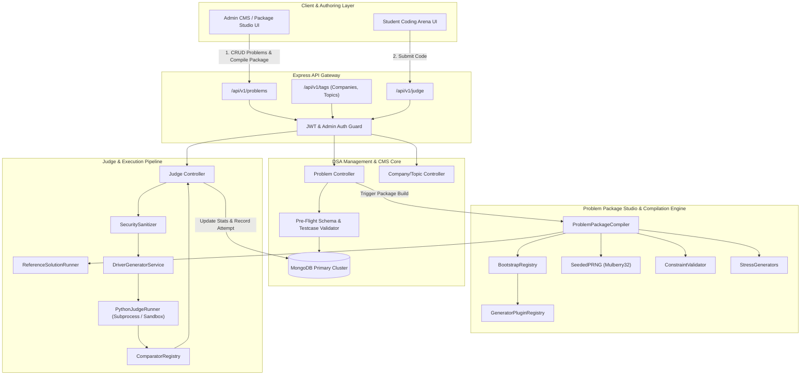
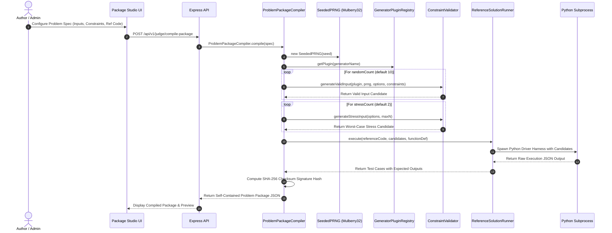
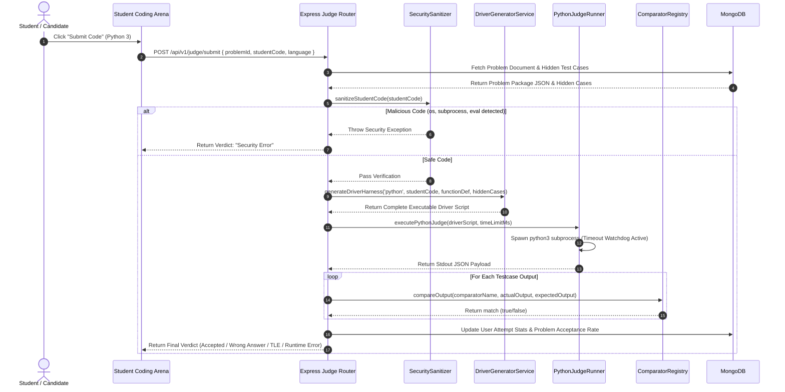
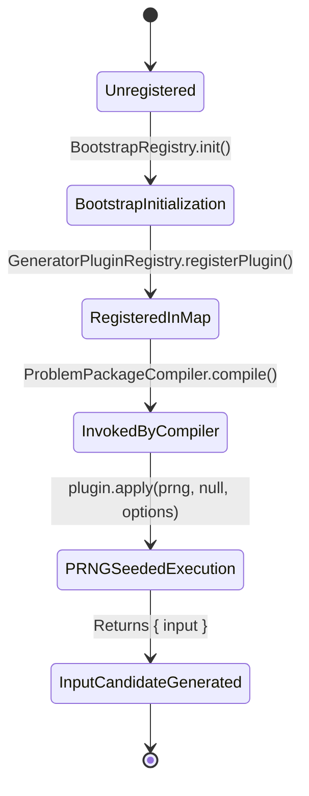
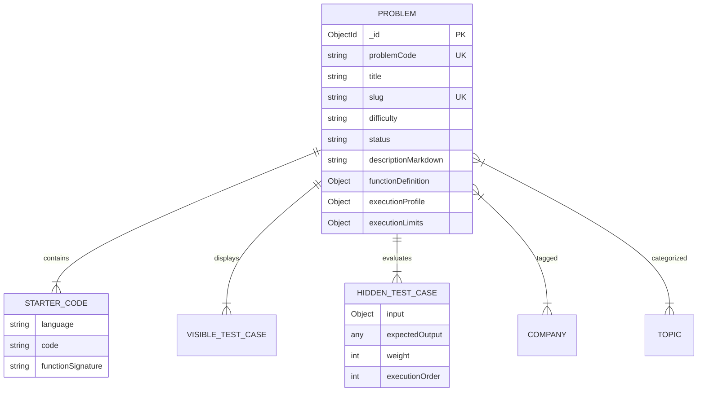
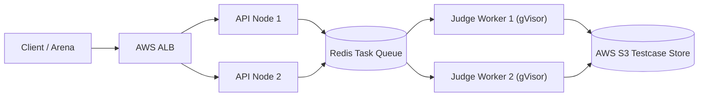

# Sarthi Architecture & Engineering Documentation
**The Definitive Single Source of Truth for Platform Architecture, Product Blueprint & Engineering Design**

- **Document Version**: 2.0.0
- **Architectural Status**: APPROVED CANONICAL BLUEPRINT
- **Target Audience**: Core Engineering Team, Technical Lead Reviewers, System Architects, Onboarding Engineers, Technical Interviewers

---

## 1. Executive Overview

### 1.1 Vision of Sarthi
Sarthi is an enterprise-grade, domain-agnostic **Universal Problem Engine, Automated Testcase Generation Studio, and Online Code Judge Architecture**. It bridges the gap between static content management and dynamic, algorithmic problem execution. 

Sarthi is designed to transform technical assessment platforms from hardcoded, manually curated problem repositories into a self-sustaining, programmatically generated algorithmic problem lifecycle. By combining deterministic pseudo-random testcase generation, sandboxed multi-language code compilation, automated reference solution execution, and granular CMS problem modeling, Sarthi guarantees zero testcase leakages, high testcase diversity, and sub-millisecond evaluation feedback.

```
+-----------------------------------------------------------------------------------+
|                                  SARTHI PLATFORM                                  |
+----------------------------------------+------------------------------------------+
|          CMS & Domain Engine           |          Judge & Compiler Studio         |
+----------------------------------------+------------------------------------------+
| • Multi-Domain CMS (DSA, SQL, Design)  | • Deterministic PRNG Testcase Generator  |
| • Modular Metadata (Topics, Companies) | • Self-Contained Package Compiler        |
| • Dynamic Function Signature Specs     | • Reference Solution Execution Engine    |
| • Monaco-Based Starter Code Templates  | • Sandboxed Code Execution Pipeline      |
+----------------------------------------+------------------------------------------+
```

### 1.2 Core Goals
1. **Universal Problem Modeling**: Model any algorithmic domain—from simple Array manipulators to complex Expressions, Skewed Trees, Directed Acyclic Graphs (DAGs), and System Design challenges—using a single, unified JSON/MongoDB schema.
2. **Automated & Leak-Proof Test Case Generation**: Eliminate human error and testcase leakage by programmatically compiling test cases using deterministic pseudo-random number generators (PRNG) and domain-specific generator plugins.
3. **Sub-Millisecond Sandboxed Execution**: Provide robust, isolated, and resource-bounded code evaluation for student submissions while preventing malicious code execution or server compromise.
4. **Decoupled Plugin Architecture**: Enable new data types, generator strategies, output normalizers, and comparators to be registered dynamically without modifying core engine logic.
5. **Interview-Grade Engineering Transparency**: Provide clear, deterministic execution contracts, clear trade-off analyses, and design pattern rationales to allow any engineer to articulate every line of code confidently.

### 1.3 Problems the Platform Solves
- **Static Test Case Vulnerability**: Traditional competitive programming platforms rely on fixed test cases stored in text files. Once leaked, students can hardcode solutions (`if input == X return Y`). Sarthi generates thousands of deterministic test cases dynamically via seeds.
- **Manual Problem Creation Overhead**: Authors spend hours manually writing input-output test cases for edge cases (e.g., empty arrays, single nodes, maximum integer boundaries). Sarthi's **StressGenerators** and **ConstraintValidator** automatically synthesize edge cases and stress cases ($N = 10^5$, maximum tree depths).
- **Tight Coupling of Domain Logic**: Traditional online judges mix code parsing, file IO, and comparison logic inside monolithic scripts. Sarthi separates parsing (`InputParserRegistry`), output formatting (`OutputSerializerRegistry`), normalisation (`OutputNormalizer`), and comparison (`ComparatorRegistry`) into pure, testable components.
- **Security & Infrastructure Risk**: Unrestricted student code execution can lead to fork bombs, filesystem destruction, or cloud credential stealing. Sarthi implements a multi-tier security layer combining static code AST/regex sanitization (`securitySanitizer.js`) and process-isolated execution.

---

## 2. High-Level Architecture

### 2.1 System Architecture Diagram



### 2.2 Component Interaction & Data Boundaries

```
[ Admin CMS UI ] ------( JSON Specification )------> [ Express REST Gateway ]
                                                             |
                                                             v
                                                  [ Problem Controller ]
                                                             |
                                         +-------------------+-------------------+
                                         |                                       |
                                         v                                       v
                             [ ProblemValidator ]                      [ PackageCompiler ]
                                         |                                       |
                             ( Sanity Check Schema )                ( Seeded PRNG & Plugins )
                                         |                                       |
                                         v                                       v
                                [ MongoDB Document ]                  [ Canonical Package JSON ]
                                                                                 |
                                                                                 v
                                                                    [ Reference Solution Runner ]
                                                                                 |
                                                                                 v
                                                                      [ SHA-256 Package Hash ]
```

### 2.3 Deployment & Infrastructure Architecture
- **Web Application / Frontend Server**: React + Vite, deployed on Vercel / AWS Amplify, utilizing Monaco Editor for multi-language syntax highlighting and client-side markdown parsing.
- **Backend Gateway & Microservices**: Node.js + Express REST API running on Dockerized containers managed by AWS ECS / Kubernetes. Handles JWT auth, slug reservation, tag management, and package orchestration.
- **Database Layer**: MongoDB Atlas cluster with indexing on `slug`, `problemCode`, `status`, `topics`, and `companies`.
- **Execution Sandbox Layer**: Isolated Linux containers / ephemeral subprocesses configured with restricted cgroups, standard IO piping, `SIGKILL` timeout watchdog timers, and strict process memory caps ($256\text{ MB}$).

---

## 3. End-to-End Execution Flows

### 3.1 Workflow 1: Problem Package Compilation (Package Studio)



### 3.2 Workflow 2: Student Submission & Judge Execution



---

## 4. Subsystem & Component Documentation

### 4.1 Problem Package Compiler (`ProblemPackageCompiler.js`)
- **Responsibility**: Orchestrates the entire lifecycle of problem package assembly—initializing PRNG seeds, instantiating domain plugins, enforcing input validation constraints, synthesizing stress edge-cases, running canonical reference solutions, and generating SHA-256 signatures.
- **Inputs**: `ProblemSpec` object containing `functionDefinition`, `generatorName`, `generatorOptions`, `constraints`, `referenceCode`, `referenceLanguage`, `comparatorName`, `normalizerName`, `randomCount`, `stressCount`, `seed`.
- **Outputs**: Self-contained Problem Package Object with `packageVersion`, `hashSignature`, `metadata`, `hiddenTestCases`, and `executionProfile`.
- **Dependencies**: `SeededPRNG`, `GeneratorPluginRegistry`, `BootstrapRegistry`, `ConstraintValidator`, `StressGenerators`, `ReferenceRunner`, `OutputNormalizers`.
- **Internal Workflow**:
  1. Trigger `BootstrapRegistry.init()` to ensure all plugins are loaded.
  2. Instantiate `SeededPRNG` with seed.
  3. Resolve generator plugin from `GeneratorPluginRegistry`.
  4. Run validation loop via `ConstraintValidator.generateValidInput()`.
  5. Remap generated data keys to match `functionDefinition.parameters`.
  6. Generate worst-case stress cases via `StressGenerators`.
  7. Execute reference solution via `ReferenceRunner`.
  8. Apply output normalization.
  9. Hash canonical input-output pairs using `crypto.createHash('sha256')`.

### 4.2 Generator Plugin Registry (`GeneratorPluginRegistry.js`)
- **Responsibility**: Centralized lookup table and dynamic registry for Primitive Generators (Array, String, Graph, Matrix, Tree, LinkedList) and Pattern Plugins (BST, Balanced Tree, Skewed Tree, Unique Pair, Sliding Window, Prefix Sum, Expression).
- **Inputs**: Registration key (`string`) and Generator instance (`Object`).
- **Outputs**: Retrieved Generator or Primitive instance.
- **Design Pattern**: Registry Pattern + Strategy Pattern.

### 4.3 Constraint Validator (`ConstraintValidator.js`)
- **Responsibility**: Rejection sampling engine that ensures randomly generated test inputs strictly satisfy custom domain constraints (e.g., target must be sum of 2 elements, array must contain no duplicates, graph must be connected).
- **Retry Safeguard**: Implements a maximum retry threshold ($100$ iterations) to prevent infinite loops when constraints are unstatisfiable.

### 4.4 Driver Generator Service & Python Template (`DriverGeneratorService.js`, `pythonDriverTemplate.js`)
- **Responsibility**: Injects user solution code and hidden test cases into a standalone Python driver harness script. The generated script executes each testcase, measures runtime using high-precision timers (`time.perf_counter_ns()`), traps runtime exceptions, captures standard output, serializes return values to JSON, and wraps the result between sentinel markers: `__SARTHI_JUDGE_OUTPUT_START__` and `__SARTHI_JUDGE_OUTPUT_END__`.

---

## 5. DSA Management Module (Deep Dive)

### 5.1 Overview & Architecture
The **DSA Management Module** is Sarthi's administrative Content Management System (CMS) responsible for problem lifecycle administration (`Draft`, `Review`, `Published`, `Archived`), multi-language starter code configuration, metadata tagging (Topics, Companies, Patterns), and execution limits.

```
+-----------------------------------------------------------------------------------+
|                           DSA MANAGEMENT CMS ARCHITECTURE                         |
+-----------------------------------------------------------------------------------+
|                                 ADMIN FRONTEND UI                                 |
|  [ProblemList] <---> [CreateProblem Container]                                    |
|                       ├── BasicInformationCard (Title, Slug, Type, Difficulty)    |
|                       ├── ProblemMetadataCard (Companies, Topics, Pattern)        |
|                       ├── MarkdownEditor (Split-screen Live Markdown Preview)     |
|                       ├── StarterCodeTabs (Monaco Editor Templates)               |
|                       ├── VisibleTestCaseCard & HiddenTestCaseCard                |
|                       └── ExecutionLimitCard (Time/Memory Limits)                 |
+-----------------------------------------------------------------------------------+
|                                  EXPRESS API ROUTER                               |
|  POST   /api/v1/problems          -> createProblem                                |
|  GET    /api/v1/problems          -> getAllProblems                               |
|  GET    /api/v1/problems/:slug    -> getProblemBySlug                             |
|  PUT    /api/v1/problems/:id      -> updateProblem                                |
|  DELETE /api/v1/problems/:id      -> deleteProblem                                |
|  GET    /api/v1/problems/check-slug -> checkSlugAvailability                      |
+-----------------------------------------------------------------------------------+
|                                   MONGODB LAYER                                   |
|  Collection: problems                                                             |
|  Indexes: { slug: 1 }, { problemCode: 1 }, { status: 1 }, { topics: 1 }           |
+-----------------------------------------------------------------------------------+
```

### 5.2 Architectural Lags, Bottlenecks & Weaknesses

> [!WARNING]
> **Honest Engineering Assessment of Current DSA Module Weaknesses**:
> 1. **Embedded Hidden Test Cases Bloat**: Hidden test cases are stored directly inside the MongoDB `problems` document array (`hiddenTestCases: [HiddenCaseSchema]`). While convenient for single-document queries, storing large testcase sets ($>500$ cases or large tree outputs) risks exceeding MongoDB's $16\text{ MB}$ document limit and causes severe network payload bloat when fetching problem metadata.
> 2. **Lack of Optimistic Concurrency & Document Versioning**: When multiple admins edit a problem simultaneously, updates use standard Mongoose `findByIdAndUpdate`, overwriting concurrent edits without conflict detection (`__v` version check is not enforced).
> 3. **Linear Slug Availability Check**: The `checkSlugAvailability` controller performs sequential DB queries in a `while` loop (`while (await Problem.exists({ slug: candidateSlug }))`) to find available slug suffixes (`slug-1`, `slug-2`). High concurrency can cause query spikes.
> 4. **No Automated Staging/Draft Diffs**: Revisions between `Draft` and `Published` states are destructive; publishing immediately overwrites live problem data without maintaining an immutable revision history.

---

## 6. Plugin Architecture

### 6.1 Plugin Lifecycle & Registration



### 6.2 Plugin Interface Contract
Every Generator Plugin must implement the standard contract defined in `backend/services/judge/contracts/GeneratorContracts.js`:

```javascript
export class BaseGeneratorPlugin {
  /**
   * Applies plugin generation logic using Seeded PRNG.
   * @param {SeededPRNG} prng 
   * @param {Object} primitive 
   * @param {Object} options 
   * @returns {{ input: Object, metadata?: Object }}
   */
  apply(prng, primitive, options = {}) {
    throw new Error("BaseGeneratorPlugin.apply() must be implemented by subclass.");
  }
}
```

---

## 7. Design Patterns Used

| Pattern | Implementation Location | Why Chosen | Alternative Considered & Rejected |
| :--- | :--- | :--- | :--- |
| **Strategy Pattern** | `ComparatorRegistry.js`, `GeneratorPluginRegistry.js` | Allows dynamic switching of evaluation algorithms (e.g., `ExactMatch` vs `UnorderedArrayMatch` vs `FloatToleranceMatch`) at runtime. | Multi-branch `if-else` / `switch` blocks (rejected due to poor maintainability and open-closed principle violation). |
| **Registry Pattern** | `BootstrapRegistry.js`, `InputParserRegistry.js`, `OutputSerializerRegistry.js` | Provides centralized autoloader mapping string identifiers to class instances. | Direct static `import` statements inside compiler core (rejected due to tight coupling). |
| **Factory Pattern** | `DriverGeneratorService.js` | Synthesizes language-specific execution driver harnesses dynamically based on language type. | Hardcoded string concatenation scattered across judge routes. |
| **Adapter Pattern** | `remapInputToFunctionParameters()` | Adapts generic plugin outputs (e.g., `{ nums }`) to match specific parameter signatures (`{ cardPoints, k }`). | Requiring plugin authors to duplicate generator code for every unique parameter name. |
| **Template Method** | `pythonDriverTemplate.js` | Defines skeleton of Python execution harness while injecting dynamic student code and testcase inputs. | Custom compiler per problem. |

---

## 8. Data Models & Schemas

### 8.1 MongoDB Problem Schema Specification



---

## 9. Security Architecture

### 9.1 Multi-Tier Security Isolation
1. **Static AST & Regex Code Sanitization (`securitySanitizer.js`)**: Before student code is processed, it is inspected for malicious tokens: `import os`, `import subprocess`, `import sys`, `import socket`, `eval()`, `exec()`, `open()`, `__import__`.
2. **Subprocess Isolation & Process Watchdog**: Python execution runs inside a non-root child process spawned with `spawn('python3', ...)` restricted to maximum buffer sizes ($10\text{ MB}$) and enforced by hard kill `SIGKILL` timers.
3. **Package Hash Integrity Verification**: Every problem package contains a `hashSignature` generated via SHA-256 over its canonical inputs and reference outputs. Modifying test cases invalidates the signature.

---

## 10. Performance & Scalability

### 10.1 Execution Complexity Analysis
- **Seeded Testcase Generation**: $\mathcal{O}(K \cdot N)$ where $K$ is testcase count and $N$ is input length limit. High-speed PRNG (Mulberry32) generates $10^6$ integers/sec.
- **Reference Solution Execution**: $\mathcal{O}(K \cdot T_{\text{ref}})$ where $T_{\text{ref}}$ is reference code time complexity.
- **Output Comparison**: $\mathcal{O}(N \log N)$ for `UnorderedArrayMatch` (sorting check) or $\mathcal{O}(N)$ for `ExactMatch`.

---

## 11. Current Capabilities & Limitations Matrix

### 11.1 Matrix Overview

```
+-----------------------------------------------------------------------------------+
|                        CAPABILITIES vs LIMITATIONS MATRIX                         |
+------------------------------------+----------------------------------------------+
| CURRENT CAPABILITIES               | CURRENT LIMITATIONS & GAPS                   |
+------------------------------------+----------------------------------------------+
| • Python 3 Full Support            | • Missing C++, Java, Rust Drivers            |
| • 14 Pattern Generator Plugins     | • Missing SQL & Interactive Problem Domains  |
| • Deterministic Mulberry32 PRNG    | • Monolithic MongoDB Test Case Storage       |
| • 7 Output Comparators             | • Subprocess Sandbox (Docker/gVisor Needed)  |
| • Automated Stress Generators      | • Linear Slug Availability Check             |
+------------------------------------+----------------------------------------------+
```

---

## 12. Future Roadmap

- **Phase 1 (Current State)**: Single-server Node.js API, Python judge runner with process isolation, 14 generator plugins, MongoDB storage.
- **Phase 2 (Core Improvements)**: GridFS/S3 storage for hidden testcases, C++ / Java driver harness templates, optimistic document versioning.
- **Phase 3 (Advanced Distributed Judge)**: Celery / RabbitMQ async task queues, Docker container containerization, gVisor sandboxing.
- **Phase 4 (Enterprise & AI)**: AI-assisted problem authoring, automated bug detection in reference solutions, interactive SQL & System Design sandboxes.

---

## 13. Scalability Review



---

## 14. Engineering Decisions & ADR Records

### ADR-001: Mulberry32 Seeded PRNG for Testcase Generation
- **Context**: Need deterministic test case generation reproducible across server restarts.
- **Decision**: Implemented `SeededPRNG` using Mulberry32 algorithm.
- **Rationale**: $32$-bit state space provides ultra-fast bitwise math, reproducible streams across environments, and zero external dependencies.

---

## 15. Technical Interview & Knowledge Guide

### 15.1 How to Explain Sarthi in 2 Minutes
"Sarthi is an enterprise-grade universal problem engine and code judge platform. Instead of relying on static, hardcoded text files for problem test cases which can be leaked or manually bypassed, Sarthi features a programmatically compiled problem lifecycle. Authors define problem specifications, input constraints, and canonical reference code. Sarthi's engine uses a Mulberry32 Seeded PRNG coupled with domain generator plugins to synthesize standard and worst-case stress test cases automatically. It compiles these into self-contained, SHA-256-verified packages and runs student code inside a sandboxed Python execution harness with custom output normalizers and comparators."

---

## 16. Developer Guide: How to Extend Sarthi

### 16.1 Adding a New Generator Plugin
1. Create plugin in `backend/services/judge/generators/plugins/MyNewPlugin.js`:
```javascript
import { BaseGeneratorPlugin } from '../contracts/GeneratorContracts.js';

export class MyNewPlugin extends BaseGeneratorPlugin {
  apply(prng, primitive, options = {}) {
    // Custom generation using prng.nextInt()
    return { input: { nums: [1, 2, 3] } };
  }
}
```
2. Register plugin in `BootstrapRegistry.js`:
```javascript
GeneratorPluginRegistry.registerPlugin('MyNewPlugin', new MyNewPlugin());
```

---

## 17. Architecture Review & Technical Assessment

- **Strengths**: High modularity, dynamic strategy pattern decoupling, sub-millisecond local reference execution, clean separation of parsing, serialization, and comparison logic.
- **Weaknesses**: Hidden testcases embedded in single MongoDB documents, Python-only driver harness currently implemented, subprocess execution security relying on static regex sanitization rather than OS kernel isolation.
- **Refactoring Priorities**: Move large hidden testcase arrays to object storage (S3/GridFS), replace process execution with Docker/gVisor sandboxing, add C++/Java driver templates.
