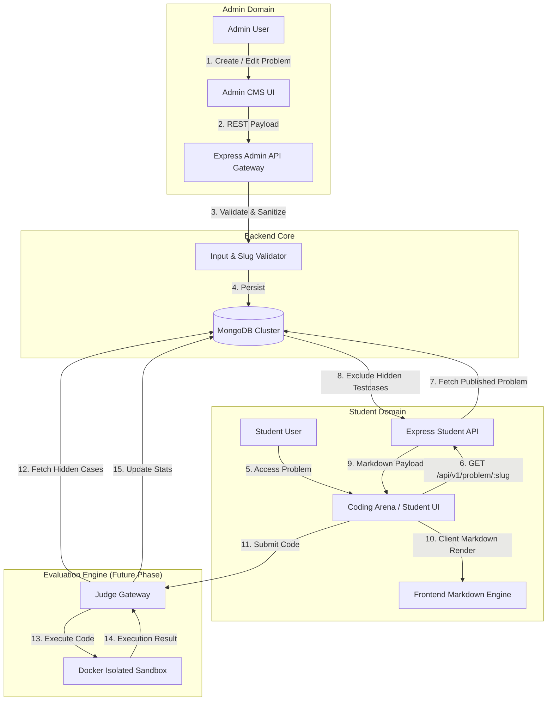
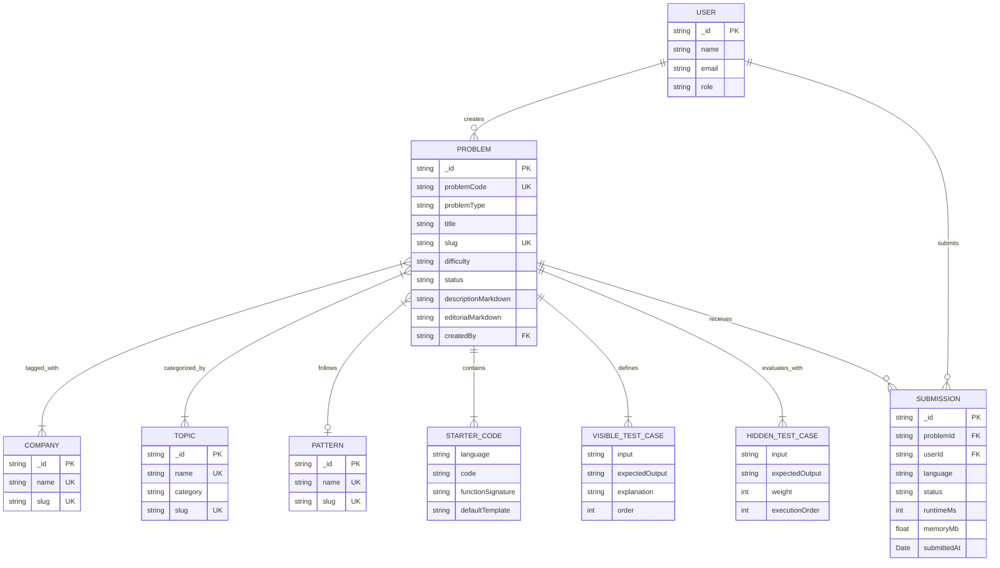
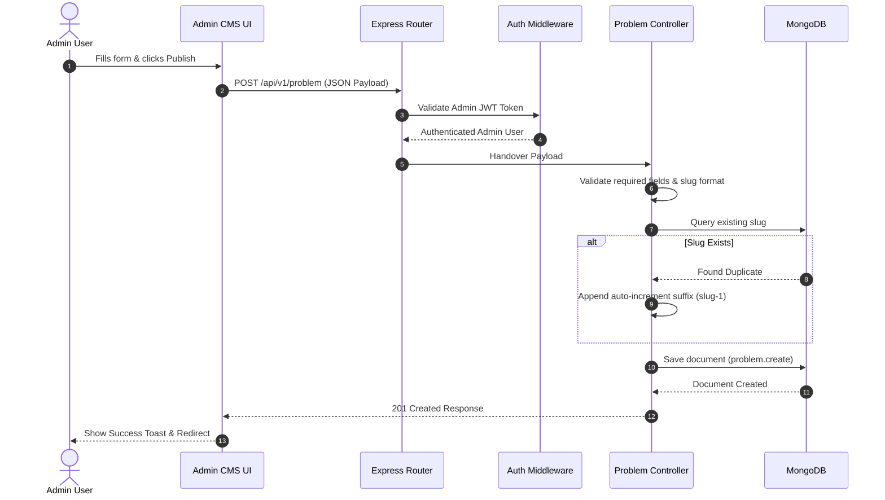
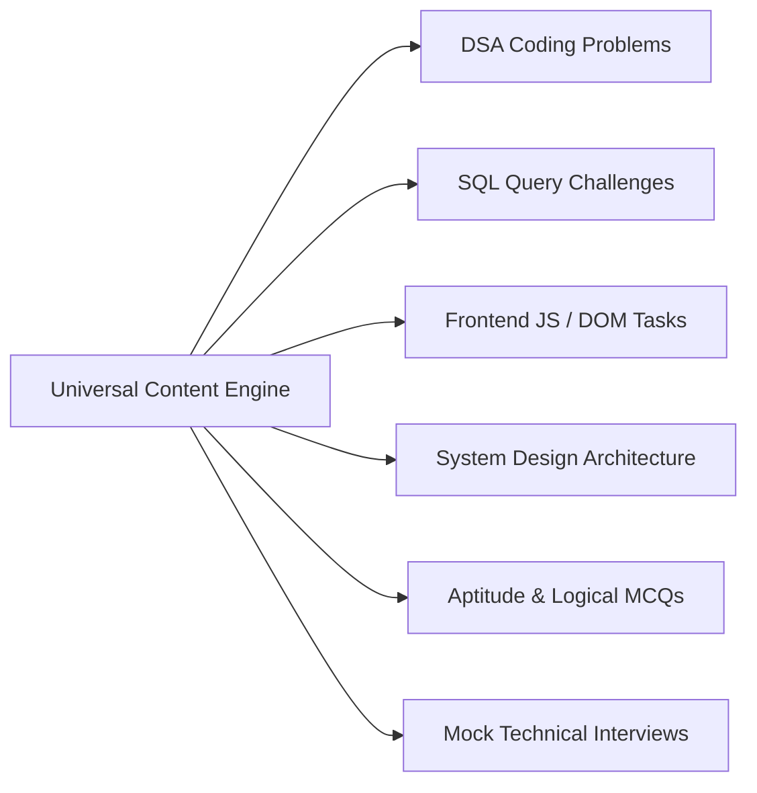
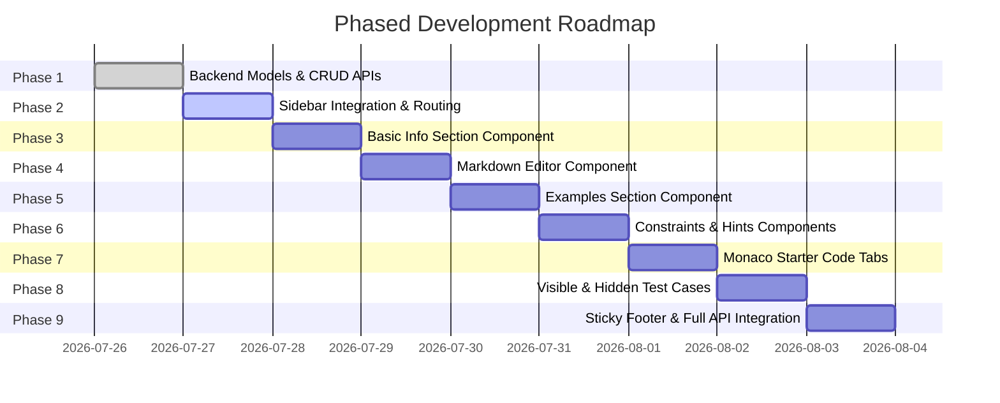

# Software Design Document (SDD)
## Sarthi Universal Problem Engine & DSA Management CMS
**Document Version**: 1.0.1  
**Date**: July 26, 2026  
**Status**: APPROVED ARCHITECTURE BLUEPRINT  

---

## 1. Executive Summary

### 1.1 Purpose
The **Sarthi Universal Problem Engine & DSA Management CMS** is an enterprise-grade content management, execution preparation, and problem distribution system. It enables administrators to create, version, categorize, and publish technical problems across multiple learning domains—including Data Structures & Algorithms (DSA), Database Systems (SQL), Web Engineering (JavaScript), System Design, Aptitude, and Mock Technical Interviews.

### 1.2 Core Goals
- **Dynamic Content Administration**: Eliminate static/hardcoded problem arrays in favor of a MongoDB-backed Content Management System.
- **Universal Problem Modeling**: Provide a unified schema supporting interactive code execution, hidden testcase evaluation, SQL queries, system design prompts, and multiple programming languages.
- **Student Performance Analytics**: Establish database entities for tracking attempt analytics, acceptance rates, revision intervals, and AI recommendation metrics.
- **Enterprise Security & Isolation**: Protect hidden testcases from client inspection and ensure secure code evaluation architecture.

### 1.3 Scope
- **In-Scope**:
  - Full-stack CRUD management for Problems, Companies, Topics, Patterns, and Execution Languages.
  - Collapsible, production-quality CMS UI in the Sarthi Admin Dashboard.
  - RESTful APIs for problem creation, status management (`Draft`, `Review`, `Published`, `Archived`), and student-facing problem fetching.
  - Multi-language starter code management with embedded Monaco Editor.
  - Rich Markdown editing with live preview and split-screen mode.
- **Future Scope**:
  - Cloudinary image asset uploads.
  - Distributed Online Compiler & Code Judge execution engine.
  - AI-assisted hints and automated code review.

---

## 2. System Architecture

### 2.1 High-Level Data Flow



### 2.2 End-to-End Flow Summary
1. **Creation**: Admin creates/edits a problem in the CMS. Data is validated on the backend and saved to MongoDB.
2. **Distribution**: When a student opens a problem, the system returns problem metadata, markdown, starter code, and *only* visible testcases. Hidden testcases are filtered out at the database query level.
3. **Execution & Stats**: Code submissions run against hidden testcases in a secure environment, updating user stats and problem performance metrics atomically.

---

## 3. Folder Structure

### 3.1 Backend Architecture (`/backend`)
```
backend/
├── models/
│   ├── problem.model.js       # Core Problem Schema & Hooks
│   ├── company.model.js       # Company Entities (Google, Meta)
│   ├── topic.model.js         # Topics (Arrays, DP, Graphs)
│   ├── pattern.model.js       # DSA Patterns (Sliding Window)
│   └── language.model.js      # Languages (Python, C++, Java)
├── services/
│   ├── problem-service/
│   │   ├── problem.controller.js  # Business Logic & Validation
│   │   ├── problem.router.js      # REST Route Declarations
│   │   └── problem.service.js     # DB Operations & Data Sanitization
│   └── tag-service/
│       ├── tag.controller.js      # CRUD for Companies/Topics/Patterns
│       └── tag.router.js          # Routes for Metadata Management
└── middleware/
    ├── adminAuth.js            # Role-Based Access Control (Admin Only)
    └── slugValidator.js        # Slug Sanitation & Availability Check
```

### 3.2 Frontend Architecture (`/frontend/src`)
```
frontend/src/
├── pages/
│   └── dsa-management/
│       ├── ProblemList.jsx         # Admin Data Table with Filters
│       ├── CreateProblem.jsx       # Accordion CMS Container
│       ├── CompanyManagement.jsx   # Company Tag CRUD
│       ├── TopicManagement.jsx     # Topic Tag CRUD
│       ├── PatternManagement.jsx   # Pattern CRUD
│       └── LanguageManagement.jsx  # Execution Language CRUD
├── components/
│   └── dsa-cms/
│       ├── BasicInformationCard.jsx
│       ├── ProblemMetadataCard.jsx
│       ├── MarkdownEditor.jsx
│       ├── ExampleCard.jsx
│       ├── ConstraintCard.jsx
│       ├── HintCard.jsx
│       ├── StarterCodeTabs.jsx
│       ├── VisibleTestCaseCard.jsx
│       ├── HiddenTestCaseCard.jsx
│       ├── ExecutionLimitCard.jsx
│       ├── EditorialCard.jsx
│       └── StickyFooter.jsx
└── services/
    └── api/
        └── Problem.api.js         # Axios HTTP Client Endpoint Bindings
```

---

## 4. Database Design

### 4.1 Collections Overview

#### Collection: `problems`
| Field | Type | Rules / Validation | Description |
| :--- | :--- | :--- | :--- |
| `_id` | ObjectId | Auto-generated PK | Unique identifier |
| `problemCode` | String | Required, Unique, Indexed | E.g., `"DSA-001"` |
| `problemType` | String | Required, Enum: `['DSA', 'SQL', 'Frontend_JS', 'System_Design', 'Aptitude', 'Mock_Interview']` | Domain classifier |
| `title` | String | Required, Trimmed, 3-150 chars | Problem Title |
| `slug` | String | Required, Unique, Lowercase, Indexed | URL-friendly identifier |
| `difficulty` | String | Required, Enum: `['Easy', 'Medium', 'Hard']` | Difficulty Level |
| `status` | String | Required, Enum: `['Draft', 'Review', 'Published', 'Archived']`, Default: `'Draft'` | Publication lifecycle |
| `companies` | `[ObjectId]` | Ref: `Company` | Tagged companies |
| `topics` | `[ObjectId]` | Ref: `Topic` | Tagged topics |
| `pattern` | ObjectId | Ref: `Pattern`, Optional | Tagged algorithmic pattern |
| `descriptionMarkdown` | String | Required | Raw Markdown description |
| `examples` | `[ExampleSchema]` | Array of `{ input, output, explanation, order }` | Sample test cases |
| `constraints` | `[String]` | Array of strings | Problem constraints |
| `hints` | `[String]` | Array of strings | Step-by-step hints |
| `starterCode` | `[StarterCodeSchema]`| Array of `{ language, code, functionSignature, defaultTemplate }` | Multi-language templates |
| `visibleTestCases` | `[TestCaseSchema]` | Array of `{ input, expectedOutput, explanation, order }` | Public test cases |
| `hiddenTestCases` | `[HiddenCaseSchema]` | Array of `{ input, expectedOutput, weight, executionOrder }` | Secret evaluation test cases |
| `executionLimits` | Object | `{ timeLimitMs: Number (100-10000), memoryLimitMb: Number (16-1024) }` | Runtime resource caps |
| `editorialMarkdown` | String | Optional | Markdown solution analysis |
| `metadata` | Object | `{ estimatedSolveTime, xpReward, revisionWeight, interviewFrequency, featuredProblem, contestProblem, learningObjective, prerequisites, recommendedNextProblems }` | AI & Analytics metadata |
| `statistics` | Object | `{ totalSubmissions, acceptedSubmissions, acceptanceRate }` | Aggregated performance metrics |
| `createdBy` | ObjectId | Ref: `User`, Required | Author admin ID |
| `createdAt` | Date | Timestamp | Creation timestamp |
| `updatedAt` | Date | Timestamp | Modification timestamp |

#### Collection: `companies`
| Field | Type | Rules | Description |
| :--- | :--- | :--- | :--- |
| `_id` | ObjectId | Auto PK | Unique ID |
| `name` | String | Required, Unique, Trimmed | E.g., `"Google"` |
| `logoUrl` | String | Optional | Brand icon URL |
| `slug` | String | Required, Unique, Lowercase | E.g., `"google"` |

#### Collection: `topics`
| Field | Type | Rules | Description |
| :--- | :--- | :--- | :--- |
| `_id` | ObjectId | Auto PK | Unique ID |
| `name` | String | Required, Unique | E.g., `"Dynamic Programming"` |
| `category` | String | Required | E.g., `"Algorithms"` |
| `slug` | String | Required, Unique | E.g., `"dynamic-programming"` |

#### Collection: `patterns`
| Field | Type | Rules | Description |
| :--- | :--- | :--- | :--- |
| `_id` | ObjectId | Auto PK | Unique ID |
| `name` | String | Required, Unique | E.g., `"Sliding Window"` |
| `description` | String | Optional | Brief overview |
| `slug` | String | Required, Unique | E.g., `"sliding-window"` |

#### Collection: `languages`
| Field | Type | Rules | Description |
| :--- | :--- | :--- | :--- |
| `_id` | ObjectId | Auto PK | Unique ID |
| `name` | String | Required | E.g., `"Python 3"` |
| `code` | String | Required, Unique | E.g., `"python"` |
| `monacoId` | String | Required | E.g., `"python"` |
| `defaultTemplate` | String | Optional | Default starter template |

---

## 5. Entity Relationship Diagram (ER Diagram)



### Relationship Rationale
- **Problem ↔ Company / Topic (Many-to-Many)**: Problems frequently cover multiple topics (e.g., *Arrays* + *Two Pointers*) and appear in interviews at multiple companies (e.g., *Amazon* + *Microsoft*).
- **Problem ↔ Pattern (Many-to-One)**: A problem typically belongs to a single core pattern (e.g., *Sliding Window*).
- **Problem ↔ Hidden Test Cases (One-to-Many Embedded)**: Embedded directly inside `problem` documents for fast single-document retrieval during submission execution.

---

## 6. API Design

### 6.1 Admin API Endpoints

#### `POST /api/v1/problem`
- **Purpose**: Create a new problem.
- **Authentication**: Admin Session Token.
- **Request Body**:
```json
{
  "title": "Fruit Into Baskets",
  "slug": "fruit-into-baskets",
  "problemType": "DSA",
  "difficulty": "Medium",
  "status": "Published",
  "companies": ["66a100018b2c120034a1ce01"],
  "topics": ["66a100028b2c120034a1ce02"],
  "pattern": "66a100038b2c120034a1ce03",
  "descriptionMarkdown": "# Fruit Into Baskets\nGiven an array...",
  "examples": [
    { "input": "[1,2,1]", "output": "3", "explanation": "We can pick from all 3 trees.", "order": 1 }
  ],
  "constraints": ["1 <= fruits.length <= 10^5"],
  "hints": ["Use a sliding window with a frequency map."],
  "starterCode": [
    { "language": "python", "code": "class Solution:\n    def totalFruit(self, fruits: List[int]) -> int:\n        pass", "functionSignature": "totalFruit(fruits: List[int]) -> int", "defaultTemplate": "" }
  ],
  "visibleTestCases": [
    { "input": "[1,2,1]", "expectedOutput": "3", "explanation": "", "order": 1 }
  ],
  "hiddenTestCases": [
    { "input": "[0,1,2,2]", "expectedOutput": "3", "weight": 1, "executionOrder": 1 }
  ],
  "executionLimits": { "timeLimitMs": 2000, "memoryLimitMb": 256 },
  "editorialMarkdown": "# Approach: Sliding Window\nUse two pointers...",
  "metadata": { "estimatedSolveTime": 25, "xpReward": 50, "revisionWeight": 1 }
}
```
- **Response (201 Created)**:
```json
{
  "success": true,
  "message": "Problem created successfully",
  "data": { "_id": "66a100098b2c120034a1ce99", "slug": "fruit-into-baskets", "problemCode": "DSA-001" }
}
```

#### `GET /api/v1/problem/check-slug`
- **Purpose**: Verify if a slug is available.
- **Query Params**: `?slug=fruit-into-baskets`
- **Response (200 OK)**:
```json
{ "success": true, "available": true, "suggestedSlug": "fruit-into-baskets" }
```

---

## 7. API Flow Diagrams

### 7.1 Problem Creation Sequence Diagram



---

## 8. Security Design

> [!IMPORTANT]
> - **Hidden Test Case Protection**: Hidden testcases (`hiddenTestCases`) are stripped at the database query level (`.select('-hiddenTestCases')`) for all non-admin endpoints. Students can never view hidden testcases in network inspect tools.
> - **Slug Sanitation**: Slugs are sanitized to lower-case alphanumeric hyphenated strings (`/^[a-z0-9-]+$/`) to prevent XSS and path traversal.
> - **Input Validation**: Backend validates execution limits (`timeLimitMs` capped at 10,000ms, `memoryLimitMb` capped at 1,024MB) to prevent server overload.

---

## 9. Performance & Scalability Design

- **Compound MongoDB Indexes**:
  - `{ slug: 1 }` (Unique Index)
  - `{ status: 1, difficulty: 1 }` (Fast filtering for student problem listings)
  - `{ companies: 1, topics: 1 }` (Tag filter queries)
- **Frontend Code Splitting & Monaco Loading**: Monaco Editor and Markdown Renderer modules are dynamic imports loaded lazily on demand to keep initial bundle size lightweight.
- **Client Markdown Cache**: Rendered markdown ASTs are cached in memory to maintain 60fps scrolling performance in the student drawer.

---

## 10. Universal Content Engine

The schema is explicitly designed to handle all learning content types across Sarthi:



- **SQL Challenges**: Evaluated by executing queries against test relational databases using `starterCode` containing SQL templates and `hiddenTestCases` containing table result assertions.
- **System Design Tasks**: Uses `descriptionMarkdown` for requirements, `starterCode` for architecture diagrams (Mermaid format), and `editorialMarkdown` for trade-off breakdowns.

---

## 11. Development Roadmap (9 Execution Phases)



### Phase 1 Execution Checklist
- [ ] Create `company.model.js`, `topic.model.js`, `pattern.model.js`, `language.model.js`, and `problem.model.js`.
- [ ] Implement `problem.controller.js` and `problem.router.js`.
- [ ] Mount routes under `/api/v1/problem` in `backend/api-gateway/router.js`.
- [ ] Verify CRUD API endpoints via build verification and route checks.

---

## 12. Design Decisions Rationale

| Decision | Selected Option | Rationale | Alternatives Considered |
| :--- | :--- | :--- | :--- |
| **Markdown Storage** | Markdown Only | Storing HTML in DB creates XSS vulnerabilities and lock-in. Storing raw Markdown allows flexible rendering across web, mobile, and IDE tools. | Storing raw HTML or JSON AST |
| **Starter Code Schema** | Array of Objects | Schema flexibility. Adding Python, Rust, Go, or SQL requires zero database migrations. | Fixed object keys (`{ python: "", java: "" }`) |
| **Deletion Model** | Soft Delete (`Archived`) | Preserves historical student submission references and revision tracking data. | Permanent Hard Deletion (`.remove()`) |
| **Tag Modeling** | Separate Collections | Allows global company/topic management and reusable tag analytics across problems. | Free-text string arrays |
